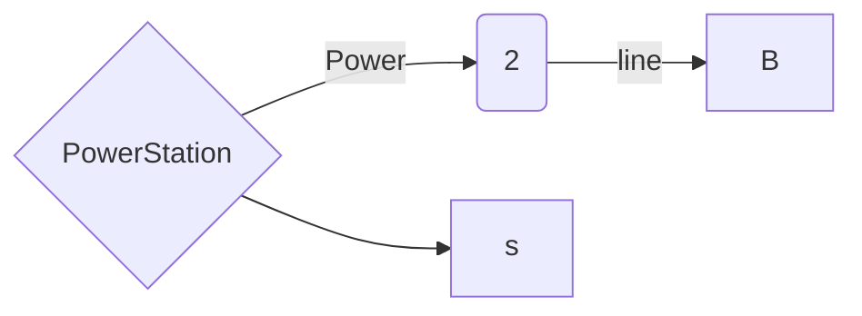

很久没做困难题了，只能说不愧是困难题，只会模板根本寸步难行，真的非常考验问题分解的能力，这种题目真的很能够把我这种在写题舒适区的人筛选出去……

所以写个傻瓜式教程吧，其实就是我的思路，算是重新写的一个直播，这样理理还是很有必要的


## 01 精简问题


读题整理条件：

- 坐标式的结点
- 结点可以通过直接发电站供电或者间接连接的两种方式供电
- 目标：最小化代价的发电站 + 电线的方案


考虑“将所有结点连接起来”、“可以成环但没必要”和“最小化代价”等特征不难隐约感觉到是个【最小生成树】的问题，但是建模看起来很困难


我们先把一些小问题给处理了：

- 数据范围：`int` 完整范围的加减甚至是相乘；大数据还是有必要加速一下的
- 得到两点之间的距离：完全可以单独先解决的一个问题
- 条件的存储和答案的存储和输出：这种我觉得是大概率可以这样存，虽然不确定，但是先这样存下来也可以后面少考虑点事情

```c++

#pragma GCC optimize(3, "Ofast", "inline")

#include <iostream>
#include <cstring>
#include <algorithm>
#include <vector>

using namespace std;

typedef long long LL;
typedef pair<int, int> PII;

const int N = 2010;
PII p[N];
int ws[N], wl[N];

vector<int> ans1;
vector<PII> ans2;

LL get_dist(int a, int b){
    int dx = abs(p[a].x - p[b].x);
    int dy = abs(p[a].y - p[b].y);
    return (LL)(dx + dy) * (wl[a] + wl[b]);
} 

int main(){
    cin >> n;
    for (int i = 1; i <= n; i++) cin >> p[i].x >> p[i].y;
    for (int i = 1; i <= n; i++) cin >> ws[i];
    for (int i = 1; i <= n; i++) cin >> wl[i];
    
    cout << prim() << '\n';
    cout << ans1.size() << '\n';
    for (int i : ans1) cout << i << ' ';
    cout << '\n';
    cout << ans2.size() << '\n';
    for (auto p : ans2) cout << p.first << ' ' << p.second << '\n';
    
    return 0;
}

```


## 02 问题建模

既然我们已知要用【最小生成树】的方法，那我们接下来就是考虑“如何将该问题转换为能够应用这个方法的形式。


我们尝试运用，我们会发现以下问题：

1. 如何把问题大致抽象成点和边来建图

2. 如何处理边的存在性以及发电站和电线之间的关系


大致是如下的一个这样的模型



我们可以把点考虑为节点，然后电线的费用考虑为节点之间的 `cost` 

大致建图的难点，就是用类似于”超级源点“的想法去理解发电站

按照这种想法来说我们是可以考虑所有点都是”连接“起来的

所以源点到各城市的 `cost` 可以考虑为建站费用

注意“直接或间接”相连这个条件，在“最小生成树”中是一定满足的

所以关系就是大体上是没有关系的，大体上就是说在作为算法处理的一个节点上是不需要单独考虑的。

但是需要做的事情是，把源点作为起点，然后一是要我们需要先单独将费用先用距离初始化出来，二是我们作为起点可以存一个父亲的记录，用于区分源点和其他点


## 03 问题解决与细节处理


首先由于我最小生成树算法也不太熟悉，我先把模板大致写下来，然后哪里不会先空着，这样等下我只要考虑把我们建的模融合进去而不用考虑算法本身了


```c++
LL prim(){
    
    memset(dist, 0x3f, sizeof dist);
    
    LL sum = 0; 
    for(int i = 0; i < n; i++){
        int t = -1;
        for (int j = 1; j <= n; j++)
            if(!st[j] && (t == -1 || dist[j] > dist[t]))
                t = j;
        
        if(i && dist[t] == INF) //
        if(i) sum += dist[t];
        st[i] = true;
        
        for(int j = 1; j <= n; j++)
            if(dist[t] < ) // 
    }
    
    return sum;
}
```


然后主要填充以下内容

1. 源点初始化和单独处理
2. 存答案，重点是一个存父亲节点的填充


```c++
LL prim()
{
    memset(dist, 0x3f, sizeof dist);
    for (int i = 1; i <= n; i++) dist[i] = wc[i];
    st[0] = true, dist[0] = 0;
    
    LL sum = 0;
    for (int i = 0; i < n; i++){ 
        int t = -1;
        for (int j = 1; j <= n; j++)
            if(!st[j] && (t == -1 || dist[t] > dist[j]))
                t = j;
        
        sum += dist[t];
        st[t] = true;
        if(!fa[t]) ans1.push_back(t);
        else ans2.push_back({fa[t], t});
        
        for(int j = 1; j <= n; j++) {
            LL dd = get_dist(t, j);
            if(dd < dist[j]){
                dist[j] = dd;
                fa[j] = t;
            }
        }
    }
    
    return sum;
    
}
```


