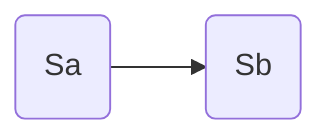
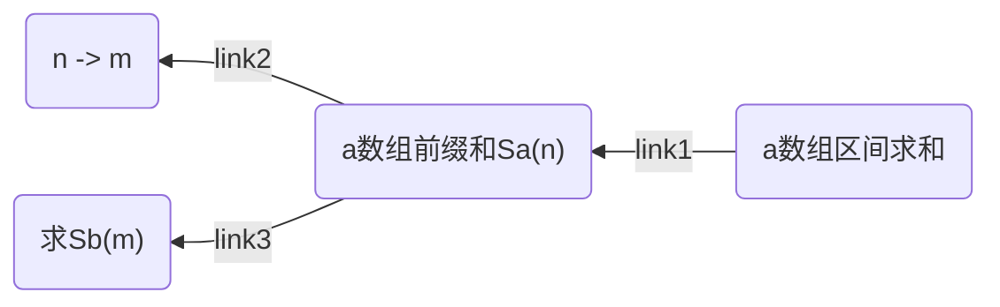

[P8762 蓝桥杯 2021 国 ABC 123 - 洛谷 | 计算机科学教育新生态](https://www.luogu.com.cn/problem/P8762)


***


## 明确问题


题目意思比较明确，给定 $1, 1, 2, 1, 2, 3, ...$ ， 这样一个有所规律的序列，然后进行区间求和


本文给出一个非常朴素的做法，没什么技巧性，强调问题分解，用尽可能低的前置知识和理解成本来解决这个问题。


## 问题分解


首先我们可以考虑一个简单的问题转换：

当我们需要频繁进行区间查询的时候，可以使用前缀和的方式来解决。

即我们设题设数组为 $a_n$ ，前 $n$ 项和为 $S_a(n)$，则可以得到： 
$$
S_a(l, r) = S_a(l) - S_a(r - 1)
$$


然后我们容易想到的一个点是，可以对数组 $a_n$ 进行分组，把无序度降低一点，使得更容易进行求和。

我们暂且不管效果如何，首先把每组的和作为 $b_n$ 看看效果
$$
b_1 = 1 \\
b_2 = 1 + 2 \\
b_3 = 1 + 2 + 3 \\
... \\
b_n = 1 + 2 + \dots n
$$


可以得到通项公式 $b_i = \frac{n \times (n + 1)}{2}$ ，$a_i$ 没法求和，现在我们可以尝试对 $b_i$ 进行前 $n$ 项求和

我们发现这个是可以做到的
$$
\begin{align}

S_b(n) \times 2 &= 1 \times 2 + 2 \times 3 + \dots + n \times (n + 1) \\ 
&=(1 + 2 + \dots + n) + (1 + 2^2 + \dots + n^2) \\
&= \frac{n \times (n + 1) \times (n + 2)}{3}

\end{align}


\implies S_b(n) = \frac{n \times (n + 1) \times (n + 2)}{6}
$$


于是我们可以把对 $a_n$ 求前缀和转换为 对 $b_n$ 数组求前缀和



接下来我们还要解决的一个问题是，做好下标的映射

关于问题分解我们就做到这里，整体上来说，我们把原来的问题转换为了两个小问题，接下来我们再解决剩下的问题





## 问题解决


先把已经解决问题的代码写上来，按上图的顺序来


主函数


```cpp
#include <iostream>
#include <cmath>
using namespace std;

typedef long long LL;
int main()
{
    
    int T; cin >> T;
    while(T--){
        LL L, R; cin >> L >> R;
        cout << get_Sa(L, R) << '\n';
    }
    
    return 0;
}
```


第一次转换 (link1)

```cpp

LL get_Sa(LL l, LL r){
    return get_Sa(r) - get_Sa(l - 1);
}

```


得到 a 数组前缀和 + link23

```cpp
LL get_Sa(LL n){
    if(!n) return 0;
    if(n == 1) return 1;
    
    LL m = get_m(n), pm = m - 1;
    
    LL k = n - (1 + pm) * pm / 2;
    LL rem = (1 + k) * k / 2;
    
    return get_Sb(pm) + rem;
}
```


n -> m

```cpp
bool check(LL x, LL n){
    LL l = (1 + x) * x / 2 + 1;
    return n >= l;
    // 返回包含答案的整个左区间
}


// i_b -> i_a \in [l, r];
// give n \in [l, r] the return the corresponding i_b
LL get_m(LL n){  
    LL l = sqrt(2 * n) - 2, r = sqrt(2 * n) + 1;
    while(l < r){
        LL mid = (l + r) >> 1;
        if(check(mid, n)) l = mid + 1;
        else r = mid;
    }
    return l;
}
```


得到 Sb 

```cpp
LL get_Sb(LL n){
    return n * (n + 1) * (n + 2) / 6;
}
```

