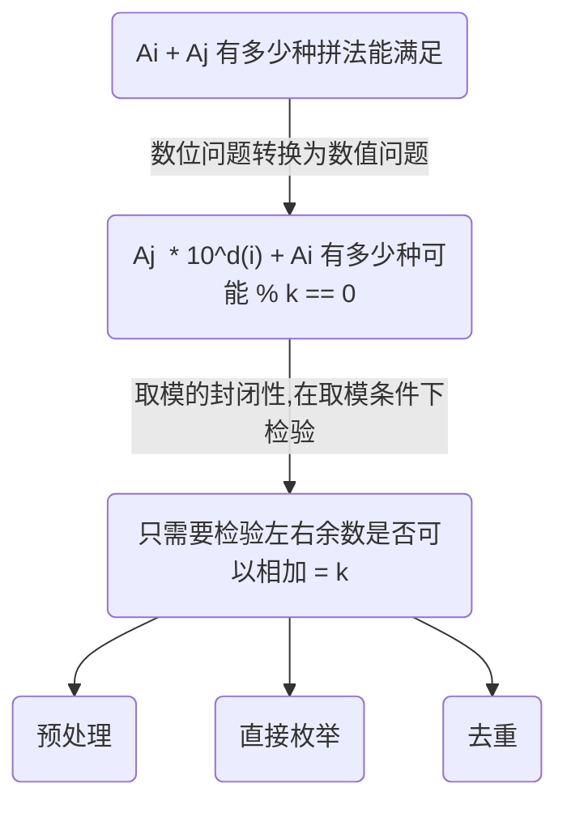

# P8712 [蓝桥杯 2020 省 B1] 整数拼接

具体的一些说明

- 预处理：根据前期考虑，我们可以一个哈希表，来处理在d(i)和余数两个维度下，满足条件的个数
- 直接枚举：在有预处理的基础上，我们可以直接根据 $A_i\ mod\ k$ 的的余数和 $len(A_i)$ 来查询满足条件的 $A_j$ 有多少个
- 去重：虽然这里题目提到，当两个要拼接的数相同的时候，依然考虑是两种拼接方法。但是当 $A_i^{d(i)} + A_i$ 预处理的是自身的时候，这个时候本身就有一次重复，所以要去掉